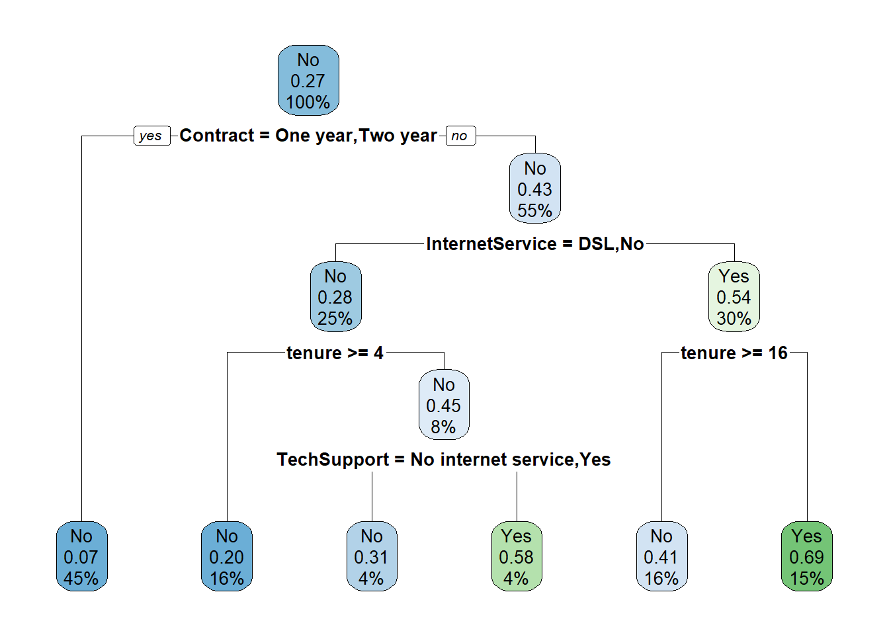
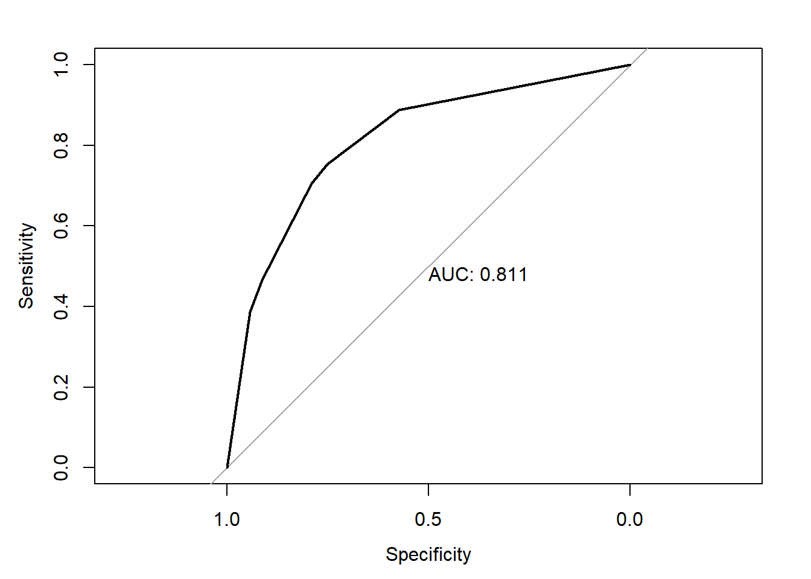
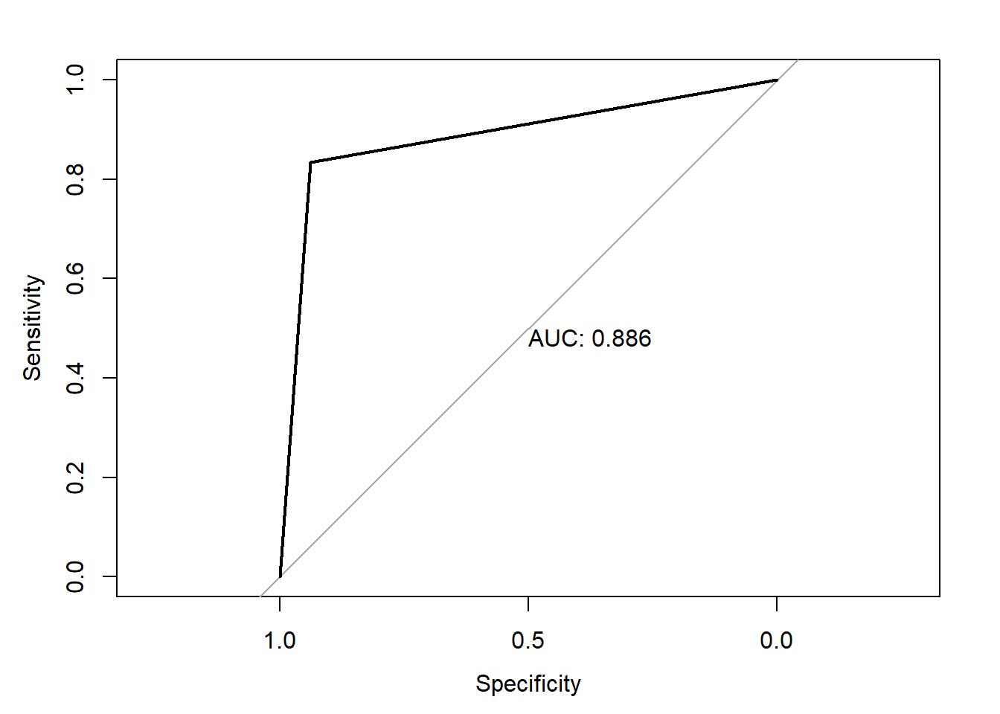
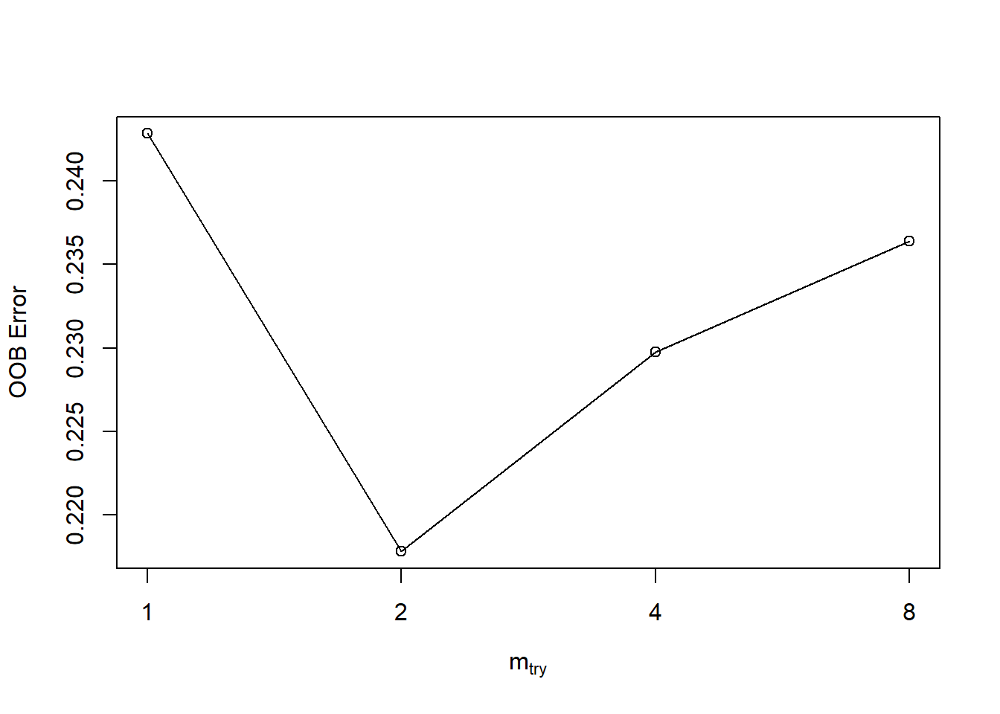
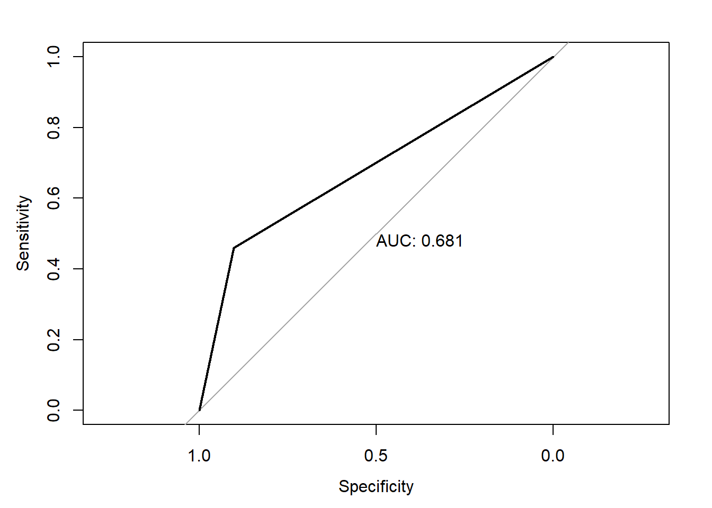
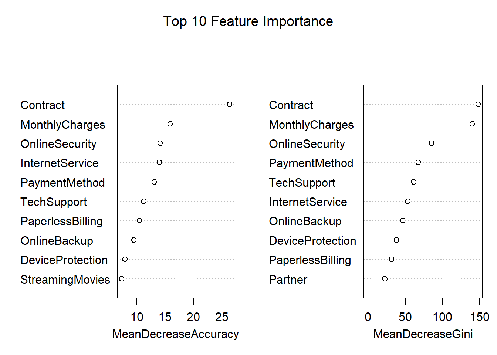
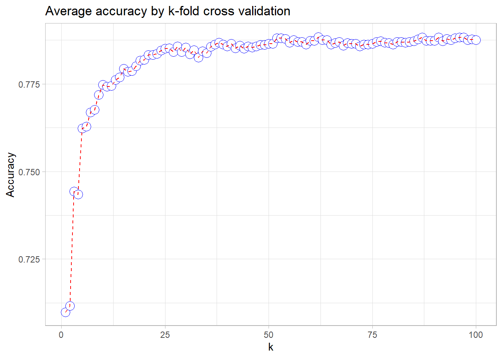
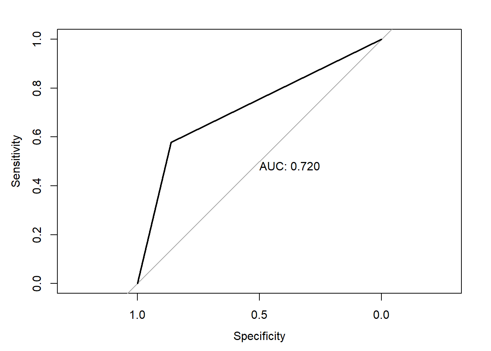
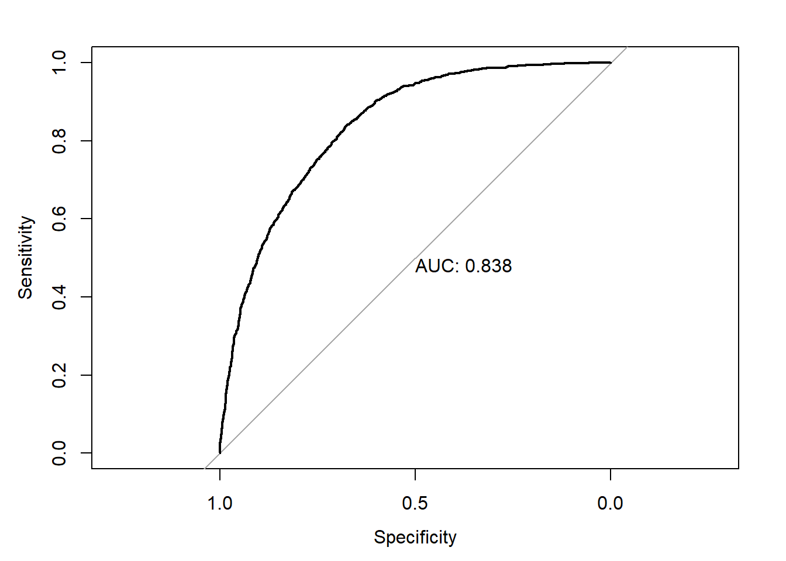
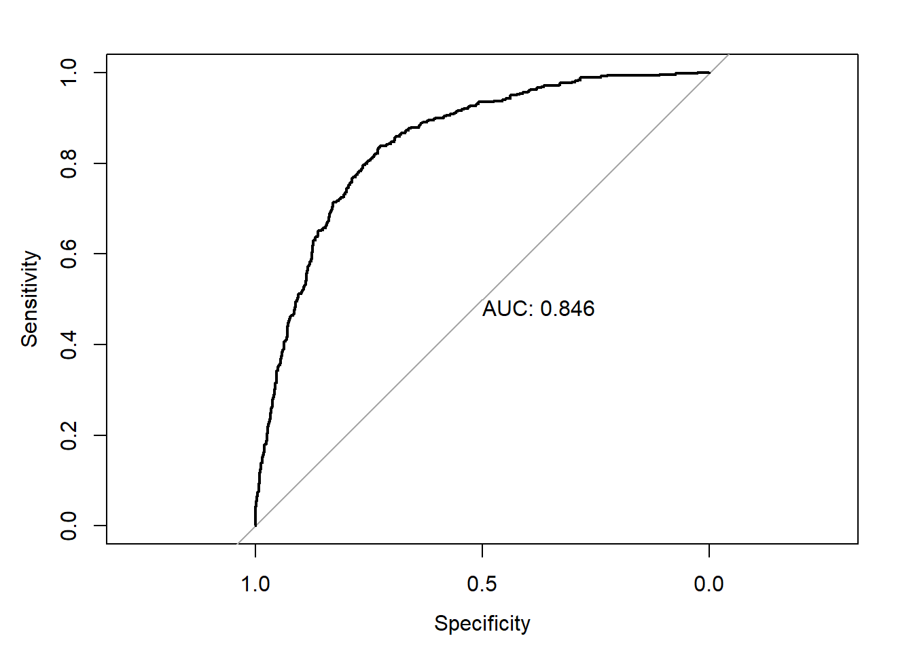

# FinalProject_Telecommunication
## DataSet

    ##   customerID           gender          SeniorCitizen      Partner         
    ##  Length:7043        Length:7043        Min.   :0.0000   Length:7043       
    ##  Class :character   Class :character   1st Qu.:0.0000   Class :character  
    ##  Mode  :character   Mode  :character   Median :0.0000   Mode  :character  
    ##                                        Mean   :0.1621                     
    ##                                        3rd Qu.:0.0000                     
    ##                                        Max.   :1.0000                     
    ##                                                                           
    ##   Dependents            tenure      PhoneService       MultipleLines     
    ##  Length:7043        Min.   : 0.00   Length:7043        Length:7043       
    ##  Class :character   1st Qu.: 9.00   Class :character   Class :character  
    ##  Mode  :character   Median :29.00   Mode  :character   Mode  :character  
    ##                     Mean   :32.37                                        
    ##                     3rd Qu.:55.00                                        
    ##                     Max.   :72.00                                        
    ##                                                                          
    ##  InternetService    OnlineSecurity     OnlineBackup       DeviceProtection  
    ##  Length:7043        Length:7043        Length:7043        Length:7043       
    ##  Class :character   Class :character   Class :character   Class :character  
    ##  Mode  :character   Mode  :character   Mode  :character   Mode  :character  
    ##                                                                             
    ##                                                                             
    ##                                                                             
    ##                                                                             
    ##  TechSupport        StreamingTV        StreamingMovies      Contract        
    ##  Length:7043        Length:7043        Length:7043        Length:7043       
    ##  Class :character   Class :character   Class :character   Class :character  
    ##  Mode  :character   Mode  :character   Mode  :character   Mode  :character  
    ##                                                                             
    ##                                                                             
    ##                                                                             
    ##                                                                             
    ##  PaperlessBilling   PaymentMethod      MonthlyCharges    TotalCharges   
    ##  Length:7043        Length:7043        Min.   : 18.25   Min.   :  18.8  
    ##  Class :character   Class :character   1st Qu.: 35.50   1st Qu.: 401.4  
    ##  Mode  :character   Mode  :character   Median : 70.35   Median :1397.5  
    ##                                        Mean   : 64.76   Mean   :2283.3  
    ##                                        3rd Qu.: 89.85   3rd Qu.:3794.7  
    ##                                        Max.   :118.75   Max.   :8684.8  
    ##                                                         NA's   :11      
    ##     Churn          
    ##  Length:7043       
    ##  Class :character  
    ##  Mode  :character  
    ##                    
    ##                    
    ##                    
    ## 

# head of data

    ##   customerID gender SeniorCitizen Partner Dependents tenure PhoneService
    ## 1 7590-VHVEG Female             0     Yes         No      1           No
    ## 2 5575-GNVDE   Male             0      No         No     34          Yes
    ## 3 3668-QPYBK   Male             0      No         No      2          Yes
    ## 4 7795-CFOCW   Male             0      No         No     45           No
    ## 5 9237-HQITU Female             0      No         No      2          Yes
    ## 6 9305-CDSKC Female             0      No         No      8          Yes
    ##      MultipleLines InternetService OnlineSecurity OnlineBackup DeviceProtection
    ## 1 No phone service             DSL             No          Yes               No
    ## 2               No             DSL            Yes           No              Yes
    ## 3               No             DSL            Yes          Yes               No
    ## 4 No phone service             DSL            Yes           No              Yes
    ## 5               No     Fiber optic             No           No               No
    ## 6              Yes     Fiber optic             No           No              Yes
    ##   TechSupport StreamingTV StreamingMovies       Contract PaperlessBilling
    ## 1          No          No              No Month-to-month              Yes
    ## 2          No          No              No       One year               No
    ## 3          No          No              No Month-to-month              Yes
    ## 4         Yes          No              No       One year               No
    ## 5          No          No              No Month-to-month              Yes
    ## 6          No         Yes             Yes Month-to-month              Yes
    ##               PaymentMethod MonthlyCharges TotalCharges Churn
    ## 1          Electronic check          29.85        29.85    No
    ## 2              Mailed check          56.95      1889.50    No
    ## 3              Mailed check          53.85       108.15   Yes
    ## 4 Bank transfer (automatic)          42.30      1840.75    No
    ## 5          Electronic check          70.70       151.65   Yes
    ## 6          Electronic check          99.65       820.50   Yes

# num of rows

    ## [1] 7043

# num of columns

    ## [1] 21

## Decsion Tree

### reprocessing

> Check NA

> Remove NA have NA

> Convert SeniorCitizen column 0, 1 to logical


## 2.1.2 Model

## decision Tree



    ## Confusion Matrix and Statistics
    ## 
    ##           Reference
    ## Prediction  No Yes
    ##        No  942 199
    ##        Yes  90 174
    ##                                           
    ##                Accuracy : 0.7943          
    ##                  95% CI : (0.7722, 0.8152)
    ##     No Information Rate : 0.7345          
    ##     P-Value [Acc > NIR] : 1.131e-07       
    ##                                           
    ##                   Kappa : 0.4183          
    ##                                           
    ##  Mcnemar's Test P-Value : 2.112e-10       
    ##                                           
    ##             Sensitivity : 0.9128          
    ##             Specificity : 0.4665          
    ##          Pos Pred Value : 0.8256          
    ##          Neg Pred Value : 0.6591          
    ##              Prevalence : 0.7345          
    ##          Detection Rate : 0.6705          
    ##    Detection Prevalence : 0.8121          
    ##       Balanced Accuracy : 0.6896          
    ##                                           
    ##        'Positive' Class : No              
    ## 

    ## Setting levels: control = 0, case = 1

    ## Setting direction: controls < cases



> ACC is 0.811

### tree pruning

    ## 
    ## Classification tree:
    ## rpart(formula = Churn ~ ., data = train, method = "class")
    ## 
    ## Variables actually used in tree construction:
    ## [1] Contract        InternetService TechSupport     tenure         
    ## 
    ## Root node error: 1496/5627 = 0.26586
    ## 
    ## n= 5627 
    ## 
    ##         CP nsplit rel error  xerror     xstd
    ## 1 0.069742      0   1.00000 1.00000 0.022153
    ## 2 0.013703      3   0.79078 0.81751 0.020681
    ## 3 0.010000      5   0.76337 0.80816 0.020595

    ## [1] 0.01


## Random Forest

### Reprocessing

> Change No phone service at MultipleLines columns to no.

> Change SeniorCitizen, 0 - No, 1 -Yes

> Remove some highly correlated input attributes that affect the
> analysis.

### 2.2.2 Model

> Training by random forest.

    ## 
    ## Call:
    ##  randomForest(formula = Churn ~ ., data = training) 
    ##                Type of random forest: classification
    ##                      Number of trees: 500
    ## No. of variables tried at each split: 4
    ## 
    ##         OOB estimate of  error rate: 22.43%
    ## Confusion matrix:
    ##       No Yes class.error
    ## No  3385 488   0.1260005
    ## Yes  695 707   0.4957204

> accuracy on train data.

    ## Confusion Matrix and Statistics
    ## 
    ##           Reference
    ## Prediction   No  Yes
    ##        No  3636  233
    ##        Yes  237 1169
    ##                                           
    ##                Accuracy : 0.9109          
    ##                  95% CI : (0.9029, 0.9185)
    ##     No Information Rate : 0.7342          
    ##     P-Value [Acc > NIR] : <2e-16          
    ##                                           
    ##                   Kappa : 0.7719          
    ##                                           
    ##  Mcnemar's Test P-Value : 0.8899          
    ##                                           
    ##             Sensitivity : 0.9388          
    ##             Specificity : 0.8338          
    ##          Pos Pred Value : 0.9398          
    ##          Neg Pred Value : 0.8314          
    ##              Prevalence : 0.7342          
    ##          Detection Rate : 0.6893          
    ##    Detection Prevalence : 0.7335          
    ##       Balanced Accuracy : 0.8863          
    ##                                           
    ##        'Positive' Class : No              
    ## 

> draw AUC



    ## mtry = 4  OOB error = 22.98% 
    ## Searching left ...
    ## mtry = 8     OOB error = 23.64% 
    ## -0.02887789 0.05 
    ## Searching right ...
    ## mtry = 2     OOB error = 21.78% 
    ## 0.0519802 0.05 
    ## mtry = 1     OOB error = 24.28% 
    ## -0.1148825 0.05



> improve model wit ntree=200, mtry=2 on train.

    ## 
    ## Call:
    ##  randomForest(formula = Churn ~ ., data = training, ntree = 200,      mtry = 2, importance = TRUE, proximity = TRUE) 
    ##                Type of random forest: classification
    ##                      Number of trees: 200
    ## No. of variables tried at each split: 2
    ## 
    ##         OOB estimate of  error rate: 22.14%
    ## Confusion matrix:
    ##       No Yes class.error
    ## No  3469 404   0.1043119
    ## Yes  764 638   0.5449358

> test and retrain.

    ## Confusion Matrix and Statistics
    ## 
    ##           Reference
    ## Prediction   No  Yes
    ##        No  1163  252
    ##        Yes  127  215
    ##                                           
    ##                Accuracy : 0.7843          
    ##                  95% CI : (0.7643, 0.8033)
    ##     No Information Rate : 0.7342          
    ##     P-Value [Acc > NIR] : 6.973e-07       
    ##                                           
    ##                   Kappa : 0.3957          
    ##                                           
    ##  Mcnemar's Test P-Value : 1.897e-10       
    ##                                           
    ##             Sensitivity : 0.9016          
    ##             Specificity : 0.4604          
    ##          Pos Pred Value : 0.8219          
    ##          Neg Pred Value : 0.6287          
    ##              Prevalence : 0.7342          
    ##          Detection Rate : 0.6619          
    ##    Detection Prevalence : 0.8054          
    ##       Balanced Accuracy : 0.6810          
    ##                                           
    ##        'Positive' Class : No              
    ## 

> draw AUC on test data.



> Top 10 feature importance



## 2.3  KNN

### 2.3.1 Reprocessing

> Remove customerId 

> Remove null data

> accuracy function

``` r
cost_matrix <- matrix(c(1,0,0,1), nrow = 2)
cost_matrix
```

    ##      [,1] [,2]
    ## [1,]    1    0
    ## [2,]    0    1

``` r
accuracy <- function(cm){
  return(cm*cost_matrix)
}
```

> cross validation with 7 fole

### 2.3.2 Model

> create a matrix save result for each k

    ## [1] 5625

    ## [1] 5625

> train data and save result with k from 1 to 100

> draw chart result by k



> Find the best k

    ## [1] 62

> Predict with test data

> accuracy

    ## [1] 0.7867804

> AUC

    ## Setting levels: control = 0, case = 1

    ## Setting direction: controls < cases



## 2.4 Logistic Regression

### 2.3.1 Reprocessing

> Tranform tenure to 5 level "1-2 years", "2-3 years", "3-4 years", "4-5
> years", "5-6 years"

    ## 
    ##  0-1 year 1-2 years 2-3 years 3-4 years 4-5 years 5-6 years 
    ##      2186      1024       832       762       832      1407

> transform data class to (0, 1)

> Remove CustomerID and create fake variabel.

> Remove rows has "No phone service"

### 2.4.2 Model

> Cross Validation (Confusion Matrix & ROC)

> Train set

    ## Confusion Matrix and Statistics
    ## 
    ##           Reference
    ## Prediction   No  Yes
    ##        No  3501  726
    ##        Yes  342  665
    ##                                           
    ##                Accuracy : 0.7959          
    ##                  95% CI : (0.7848, 0.8068)
    ##     No Information Rate : 0.7342          
    ##     P-Value [Acc > NIR] : < 2.2e-16       
    ##                                           
    ##                   Kappa : 0.4267          
    ##                                           
    ##  Mcnemar's Test P-Value : < 2.2e-16       
    ##                                           
    ##             Sensitivity : 0.9110          
    ##             Specificity : 0.4781          
    ##          Pos Pred Value : 0.8282          
    ##          Neg Pred Value : 0.6604          
    ##              Prevalence : 0.7342          
    ##          Detection Rate : 0.6689          
    ##    Detection Prevalence : 0.8076          
    ##       Balanced Accuracy : 0.6945          
    ##                                           
    ##        'Positive' Class : No              
    ## 



> Test set

    ## Confusion Matrix and Statistics
    ## 
    ##           Reference
    ## Prediction   No  Yes
    ##        No  1216  250
    ##        Yes  115  228
    ##                                          
    ##                Accuracy : 0.7982         
    ##                  95% CI : (0.779, 0.8165)
    ##     No Information Rate : 0.7358         
    ##     P-Value [Acc > NIR] : 3.474e-10      
    ##                                          
    ##                   Kappa : 0.4295         
    ##                                          
    ##  Mcnemar's Test P-Value : 2.318e-12      
    ##                                          
    ##             Sensitivity : 0.9136         
    ##             Specificity : 0.4770         
    ##          Pos Pred Value : 0.8295         
    ##          Neg Pred Value : 0.6647         
    ##              Prevalence : 0.7358         
    ##          Detection Rate : 0.6722         
    ##    Detection Prevalence : 0.8104         
    ##       Balanced Accuracy : 0.6953         
    ##                                          
    ##        'Positive' Class : No             
    ## 



